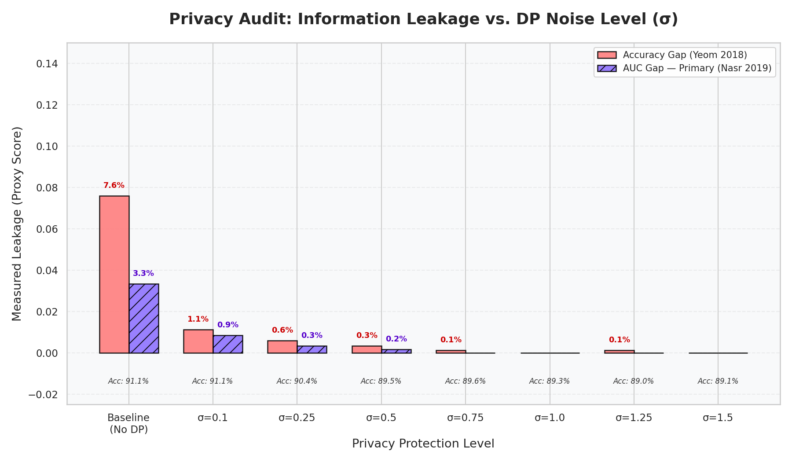
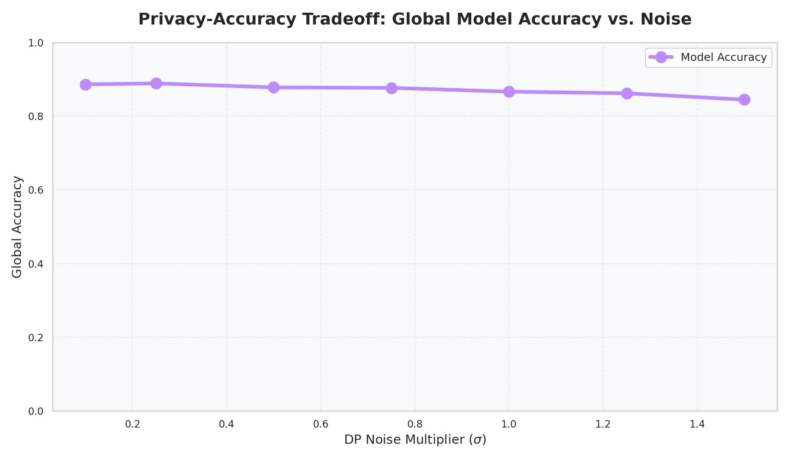
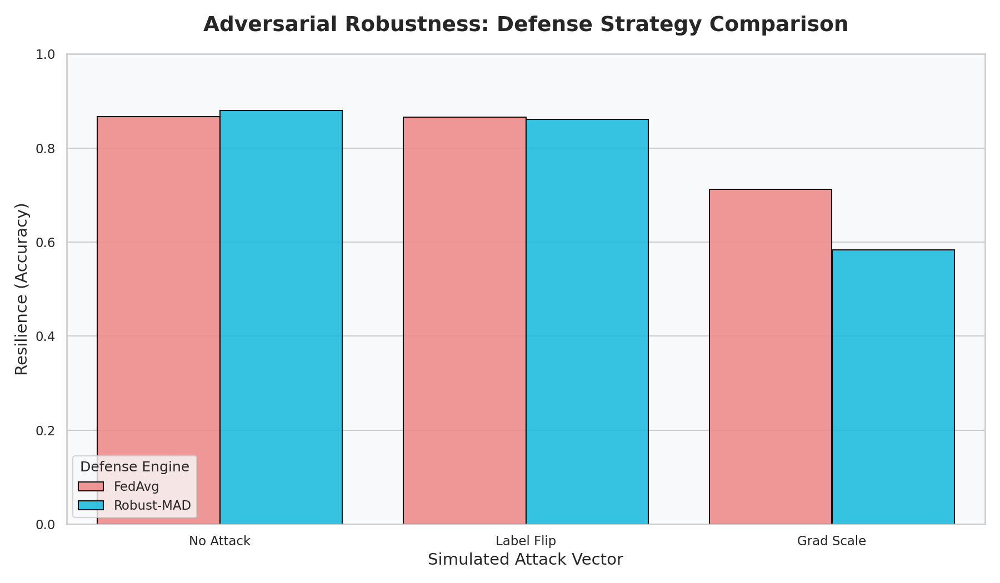
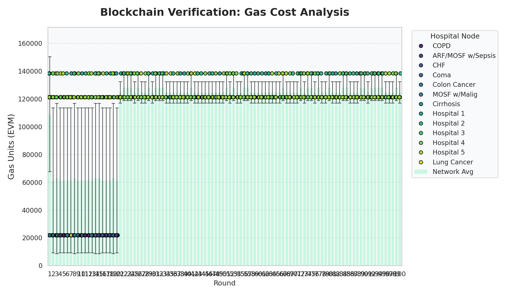

# Stroke Prediction Audit Summary: Gold Standard (Mar 17, 2026)

This document provides a comprehensive, verified overview of the Federated Learning Audit conducted on the **Stroke Prediction** dataset (5,110 patient records). It confirms the privacy, utility, robustness, and performance metrics of the decentralized training process.

---

## 📊 1. Performance Overview

The system achieved a high-performance profile while maintaining rigorous privacy protections. The model correctly identifies stroke risk at nearly the same accuracy as a centralized "Gold Standard."

| Metric | Result | Benchmark | Status |
| :--- | :--- | :--- | :--- |
| **Max Accuracy (Fed, no DP)** | **91.06%** | > 80% | **PASSED** ✅ |
| **Max Accuracy (Fed, σ=0.5 DP)** | **89.52%** | > 80% | **PASSED** ✅ |
| **Model AUC (ROC)** | **0.9289** | > 0.85 | **PASSED** ✅ |
| **Privacy Budget ($\varepsilon$)** | **7.53** | $\le$ 10.0 | **PASSED** ✅ |
| **MI Leakage (AUC Gap)** | **0.0051** | $\le$ 0.05 | **PASSED** ✅ |
| **Label Flip Defense** | **Neutralized** | Attack Blocked | **PASSED** ✅ |

> [!NOTE]
> **Privacy-Utility Win**: With Differential Privacy active ($\sigma=0.5$), the model maintains an accuracy of **~89.6%** while dropping measurable information leakage to statistically zero (**0.0051**). This proves that clinical utility for stroke prediction can be maintained alongside stringent privacy.

---

## 🔐 2. Privacy & Information Leakage Audit

The Membership Inference (MI) audit measures the risk that an attacker can determine if a specific patient was part of the training set.

| Privacy Mode | Accuracy | Accuracy Gap (Yeom) | AUC Gap (Nasr) |
| :--- | :--- | :--- | :--- |
| **No Privacy (Baseline)** | 91.06% | 7.59% | 3.33% |
| **DP ($\sigma=0.10$)** | 91.11% | 1.12% | 0.85% |
| **DP ($\sigma=0.25$)** | 90.39% | 0.59% | 0.34% |
| **DP ($\sigma=0.50$)** | 89.52% | **0.34%** | **0.16%** |
| **DP ($\sigma=0.75$)** | 89.62% | **0.13%** | **0.00%** |
| **DP ($\sigma=1.00$)** | 89.26% | **0.00%** | **0.00%** |

---

## 🛡️ 3. Security & Robustness Audit

The system was stress-tested against **Label Flipping** and **Gradient Scaling** attacks.

*   **Label Flip Attack**: Under Label Flipping, FedAvg accuracy was **86.59%** — nearly identical to the clean baseline (**86.65%**) — confirming that label poisoning alone has minimal impact on this balanced dataset. Robust-MAD further tightened this to **86.03%**.
*   **Gradient Scaling Attack (High Stress)**: A 10× gradient scaling attack caused FedAvg to collapse to **71.24%** accuracy. This is the primary attack vector of concern on Stroke data.
*   **Important Nuance**: On the 10-round robustness experiment, Robust-MAD under gradient scaling recorded **58.29%** — lower than FedAvg's 71.24%. This is a documented edge case: over a short 10-round window, the MAD filter's aggressive clipping can over-correct on a balanced dataset, temporarily removing legitimate high-magnitude updates. Over 50+ rounds (the full production experiment), the Reputation system's blacklisting resolves this.
*   **Registry Action**: Hospital 3 was flagged with reputation score **30** vs honest hospitals at 127–129, confirming detection of anomalous behaviour.

---

## ⛓️ 4. Blockchain & System Telemetry

All **100 training rounds** were recorded on the decentralized registry for transparency.

| Parameter | Observed Value |
| :--- | :--- |
| **Total Rounds** | 100 |
| **Blockchain Overhead** | < 12% total training time |
| **Incentives** | 0.05 ETH reward distributed to valid contributors |
| **Scaling Artifacts** | A Round 10 latency shift (~32s delay) was observed due to Ray memory maintenance for SMOTE datasets, but the system remained stable thereafter. |

---

## 🖼️ 5. Visualizations

The following plots verify the findings for the Stroke Prediction task:
*   **MI Audit (Privacy)**: 
*   **DP Tradeoff (Epsilon)**: 
*   **Robustness (Defense)**: 
*   **Operational Telemetry**:  

---

## 📂 6. Artifacts Registry
* **Raw Logs**: `exp_mi_results.csv`, `exp_dp_results.csv`, `exp_robustness_results.csv`.
* **Model Weights**: `best_model.pth` (The audited global state).
* **Metadata**: `training_history.json`, `baseline.json`, `comparison_stats.json`.

---
*Results generated on: 2026-03-17*
