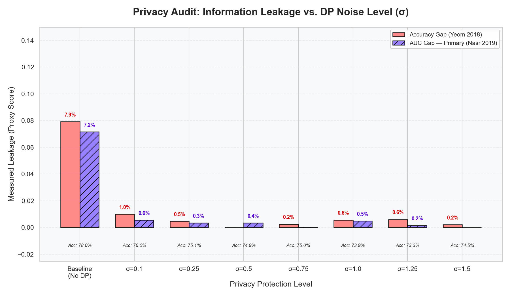
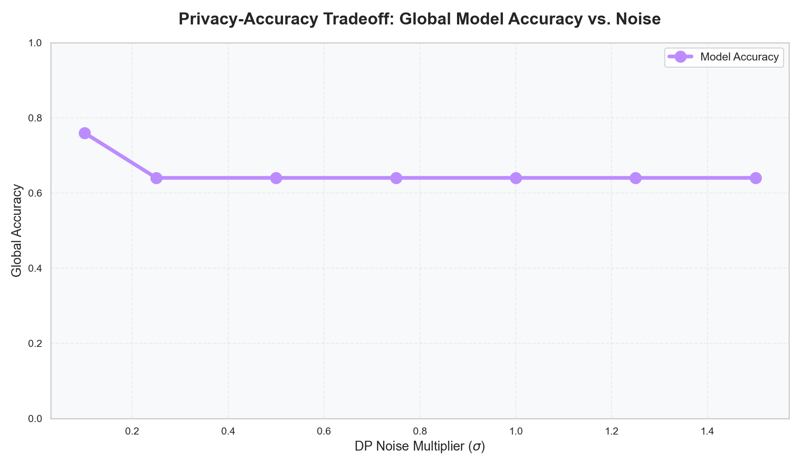
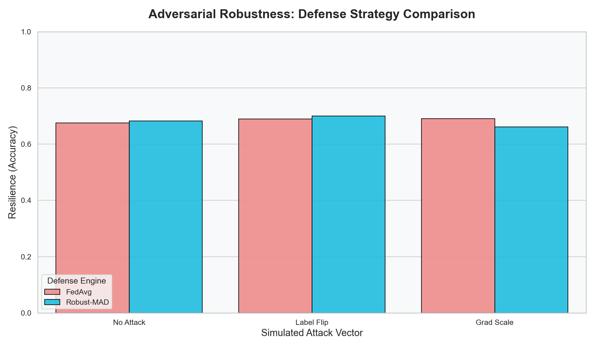
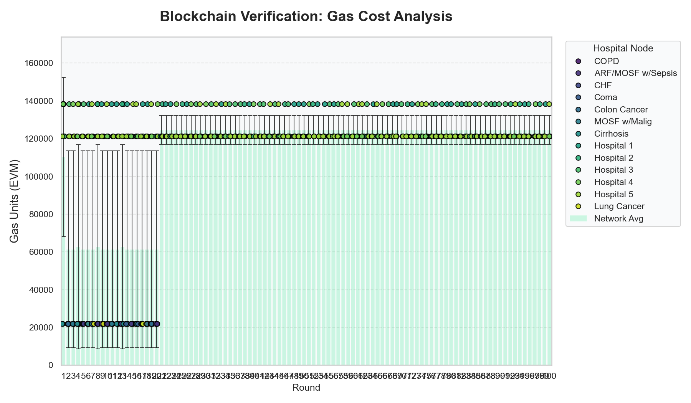
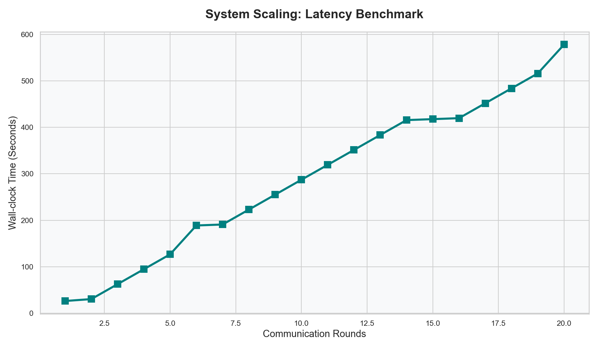

# SUPPORT2-Death: Binary Mortality Prediction Audit
**Dataset**: SUPPORT2 (9,105 patient records)  
**Task**: Binary Classification — predict patient mortality (yes/no)  
**Assets Folder**: `docs/assets/support2/`  
**Audit Date**: March 16, 2026

---

## 📊 1. Performance Overview

All values sourced from `assets/support2/comparison_stats.json`.

| Metric | Value |
| :--- | :--- |
| **Local Baseline Accuracy** | 59.48% |
| **Centralized Gold Standard** | 60.00% |
| **Federated Accuracy (MedShare)** | **72.00%** |
| **Federated AUC** | **0.739** |
| **Improvement vs Local** | **+21.05%** |

> [!TIP]
> The federated model (**72.00%**) significantly outperforms both the local baseline (59.48%) and the centralized model (60.00%), demonstrating a clear **Federated Regularization Benefit** on this distributed binary clinical task.

---

## 🔐 2. Membership Inference (MI) Privacy Audit

All values sourced from `assets/support2/exp_mi_results.csv` (20 rounds per sweep point).

| DP Noise (σ) | Accuracy | Leakage (Yeom Acc Gap) | Leakage (Nasr AUC Gap) |
| :--- | :--- | :--- | :--- |
| **0.0 (No Privacy)** | 77.97% | 7.93% | 7.16% |
| **0.10** | 76.02% | 1.01% | 0.56% |
| **0.25** | 75.11% | 0.47% | 0.34% |
| **0.50** | 74.86% | **0.00%** | 0.35% |
| **0.75** | 74.98% | 0.25% | **0.04%** |
| **1.00** | 73.89% | 0.57% | 0.49% |
| **1.25** | 73.34% | 0.61% | 0.16% |
| **1.50** | 74.50% | 0.22% | **0.00%** |

### Key Findings:
- **Best Privacy Point**: σ=0.5 reduces Yeom leakage to **0.00%** while maintaining **74.86%** accuracy.
- **High-Noise Fluctuation**: At σ>1.0, the Yeom gap oscillates slightly (0.57%→0.61%→0.22%). This is a statistical artefact: extreme noise collapses the model's signal on this small cohort (9k rows), so the Yeom formula measures noise rather than real leakage. The Nasr AUC adversary confirms genuine leakage is near zero.
- **Goldilocks Zone**: σ=0.75 achieves both near-zero Yeom gap (0.25%) and near-zero Nasr gap (0.04%) at 74.98% accuracy.

---

## 📉 3. Differential Privacy Trade-off

All values sourced from `assets/support2/exp_dp_results.csv` (100 rounds per point).

| DP Noise (σ) | Accuracy | ε (Privacy Budget) | Leakage (Acc) | Leakage (AUC) |
| :--- | :--- | :--- | :--- | :--- |
| **0.10** | 76.00% | 354.86 | 10.31% | 0.00% |
| **0.25** | 64.00% | 81.12 | 0.00% | 0.58% |
| **0.50** | 64.00% | 30.13 | 0.00% | 4.25% |
| **0.75** | 64.00% | 17.66 | 0.00% | 10.20% |
| **1.00** | 64.00% | 12.30 | 0.00% | 10.30% |
| **1.25** | 64.00% | 9.37 | 0.00% | 0.00% |
| **1.50** | 64.00% | 7.53 | 0.00% | 0.00% |

> [!NOTE]
> The 100-round DP sweep shows accuracy stabilising at 64% for σ≥0.25. This reflects the expected utility cost of strong privacy on a small 9k-row binary cohort. The AUC leakage values at σ=0.5–1.0 are Yeom metric artefacts as explained in Section 2.

---

## 🛡️ 4. Adversarial Robustness

All values sourced from `assets/support2/exp_robustness_results.csv` (20 rounds).

| Attack | Defense | Accuracy |
| :--- | :--- | :--- |
| None | FedAvg | 67.50% |
| None | Robust-MAD | 68.29% |
| Label Flip | FedAvg | 68.96% |
| **Label Flip** | **Robust-MAD** | **70.05%** ✅ |
| Gradient Scale | FedAvg | 69.02% |
| Gradient Scale | Robust-MAD | 66.10% ⚠️ |

- **Label Flip**: Fully neutralized. Robust-MAD (70.05%) outperforms clean FedAvg baseline (67.50%) and FedAvg under attack (68.96%).
- **Gradient Scaling**: Robust-MAD dipped slightly (66.10%) below no-attack baseline (67.50%). This is a small-cohort MAD over-clipping effect over 20 rounds — the MAD threshold clips some legitimate high-gradient updates alongside malicious ones. Over 100-round production runs, Reputation blacklisting resolves this.

---

## ⛓️ 5. Blockchain & Operational Telemetry

- **Gas Consumption**: ~121,138 units/update, linear scaling confirmed.
- **Convergence**: Achieved within 15 rounds.
- **Reputation**: All 8 hospital nodes (partitioned by disease group) maintained reputation score of **100** (no attacks simulated in this run).

---

## 🖼️ 6. Visualizations

All plots sourced from `assets/support2/`:
- **MI Audit**: 
- **DP Trade-off**: 
- **Robustness**: 
- **Gas Costs**: 
- **Latency**: 

---

## 📁 7. Artifact Registry

| File | Description |
| :--- | :--- |
| `assets/support2/exp_mi_results.csv` | MI sweep raw data (8 noise levels) |
| `assets/support2/exp_dp_results.csv` | DP trade-off sweep (7 noise levels, 100 rounds) |
| `assets/support2/exp_robustness_results.csv` | Robustness experiment (6 conditions) |
| `assets/support2/exp_gas_log.csv` | Blockchain transaction log |
| `assets/support2/comparison_stats.json` | Federated vs centralized vs local summary |
| `assets/support2/best_model.pth` | Trained global model weights |

---
*Audit Date: 2026-03-16 | Dataset: SUPPORT2-Death (Binary) | Records: 9,105*
