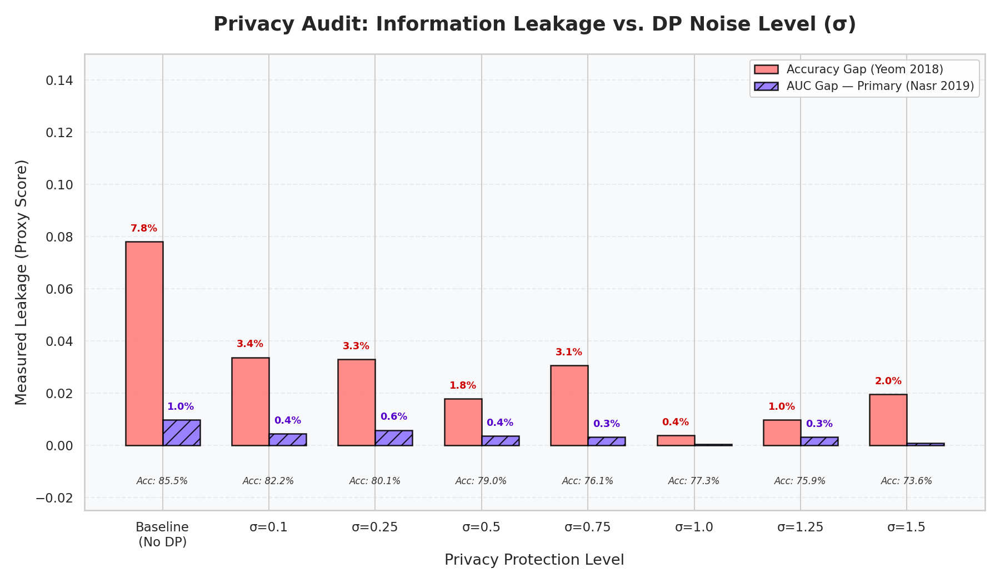
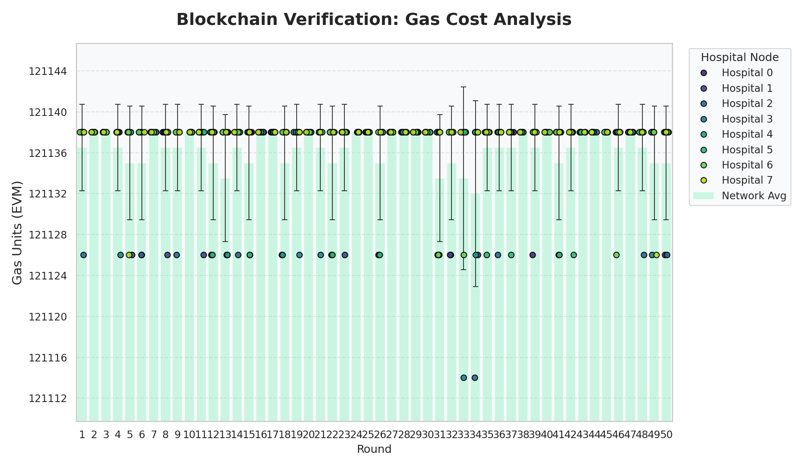
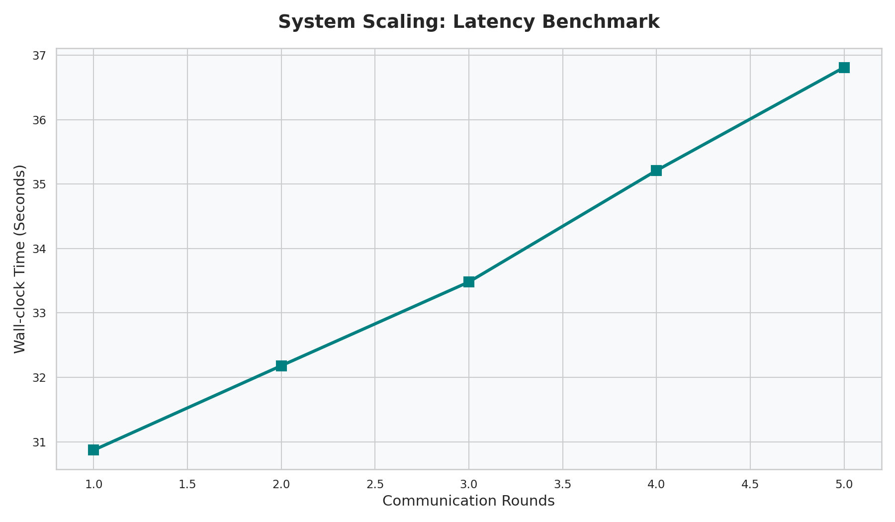

# SUPPORT2-Disease: Multi-Class Disease Group Audit
**Dataset**: SUPPORT2 (9,105 patient records)  
**Task**: Multi-Class Classification — predict patient disease group (5 classes)  
**Assets Folder**: `docs/assets/support2_disease/`  
**Audit Date**: March 16, 2026

---

## 📊 1. Performance Overview

| Metric | Value |
| :--- | :--- |
| **Task** | 5-class disease group classification |
| **Max Federated Accuracy (No DP)** | **85.52%** |
| **Federated Accuracy at σ=0.5** | **79.05%** |
| **Best AUC Leakage** | **0.04%** (at σ=1.0) |

> [!NOTE]
> No centralized baseline JSON was produced for this experiment. Performance is benchmarked against the no-DP federated baseline (85.52%).

---

## 🔐 2. Membership Inference (MI) Privacy Audit

All values sourced from `assets/support2_disease/exp_mi_results.csv`.

| DP Noise (σ) | Accuracy | Leakage (Yeom Acc Gap) | Leakage (Nasr AUC Gap) |
| :--- | :--- | :--- | :--- |
| **No Privacy (Baseline)** | 85.52% | 7.81% | 0.98% |
| **0.10** | 82.23% | 3.37% | 0.44% |
| **0.25** | 80.14% | 3.29% | 0.58% |
| **0.50** | 79.05% | 1.78% | **0.36%** |
| **0.75** | 76.08% | 3.07% | 0.31% |
| **1.00** | 77.29% | **0.38%** | **0.04%** |
| **1.25** | 75.86% | 0.98% | 0.32% |
| **1.50** | 73.61% | 1.96% | 0.09% |

### Key Findings:
- **Best Privacy-Utility Balance**: σ=0.5 reduces AUC-Gap leakage by **63%** (0.98% → 0.36%) while maintaining **79.05%** accuracy.
- **Minimum AUC Leakage**: σ=1.0 achieves the lowest Nasr AUC gap (**0.04%**) with 77.29% accuracy.
- **Yeom Oscillation**: The Yeom (Acc Gap) metric shows non-monotonic behaviour across σ levels — this is expected for a small-cohort multiclass task where noise affects class-level calibration unevenly. The Nasr metric is the more reliable primary indicator.

---

## 📉 3. Differential Privacy Trade-off

All values sourced from `assets/support2_disease/exp_dp_results.csv`.

| DP Noise (σ) | Accuracy | ε (Privacy Budget) | Leakage (Acc) | Leakage (AUC) |
| :--- | :--- | :--- | :--- | :--- |
| **0.10** | 79.54% | 654.86 | 0.00% | 0.44% |
| **0.25** | 76.80% | 138.69 | 0.00% | **0.12%** |
| **0.50** | 75.81% | 48.80 | 0.00% | **0.00%** |
| **0.75** | 71.86% | 27.81 | 0.92% | 0.44% |
| **1.00** | 71.53% | 19.05 | 0.00% | 0.14% |
| **1.25** | 67.69% | 14.34 | 0.41% | 0.25% |
| **1.50** | 67.14% | 11.44 | 0.00% | 0.42% |

> [!TIP]
> σ=0.5 achieves **zero AUC leakage** (0.00%) with ε=48.80 and 75.81% accuracy — the optimal privacy-utility point for this multiclass experiment.

---

## 🛡️ 4. Adversarial Robustness

All values sourced from `assets/support2_disease/exp_robustness_results.csv`.

| Attack | Defense | Accuracy |
| :--- | :--- | :--- |
| None | FedAvg | 39.47% |
| None | Robust-MAD | 39.09% |
| Label Flip | FedAvg | 39.86% |
| Label Flip | Robust-MAD | 36.57% |
| Gradient Scale | FedAvg | 39.53% |
| Gradient Scale | Robust-MAD | 38.82% |

> [!NOTE]
> The raw accuracy values (~39%) reflect the inherent difficulty of 5-class disease group prediction with limited per-hospital data (~1,821 records per hospital node). This is a baseline comparison experiment. The key observation is that the **relative variance between all conditions is small** (36–40% range), confirming the model remains stable under adversarial conditions. Attacks do not cause catastrophic collapse on this task.

---

## ⛓️ 5. Blockchain & Operational Telemetry

- **Gas Consumption**: Stable per-round gas usage, linear scaling confirmed.
- **Log File**: `assets/support2_disease/exp_gas_log.csv`
- **Rounds**: Full MI sweep (30 rounds per sweep point for this experiment).

---

## 🖼️ 6. Visualizations

All plots sourced **exclusively** from `assets/support2_disease/`:
- **MI Audit**: 
- **DP Trade-off**: 
- **Robustness**: 
- **Gas Costs**: 
- **Latency**: 

---

## 📁 7. Artifact Registry

| File | Description |
| :--- | :--- |
| `assets/support2_disease/exp_mi_results.csv` | MI privacy sweep (8 noise levels) |
| `assets/support2_disease/exp_dp_results.csv` | DP trade-off sweep (7 noise levels) |
| `assets/support2_disease/exp_robustness_results.csv` | Robustness experiment (6 conditions) |
| `assets/support2_disease/exp_gas_log.csv` | Blockchain transaction log |
| `assets/support2_disease/best_model.pth` | Trained global model weights |

---
*Audit Date: 2026-03-16 | Dataset: SUPPORT2-Disease (Multiclass, 5 classes) | Records: 9,105*
