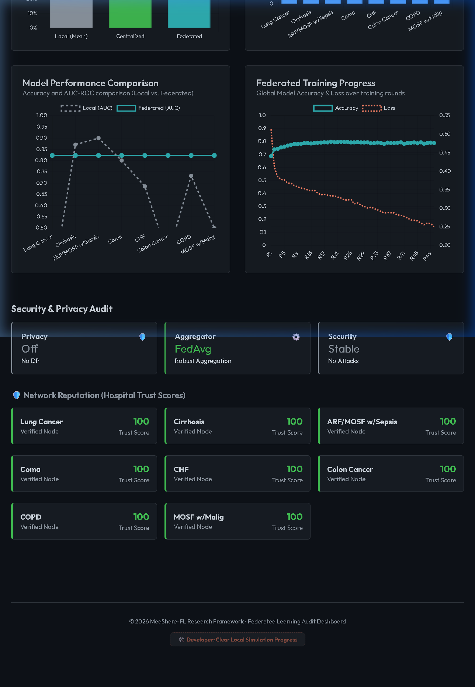
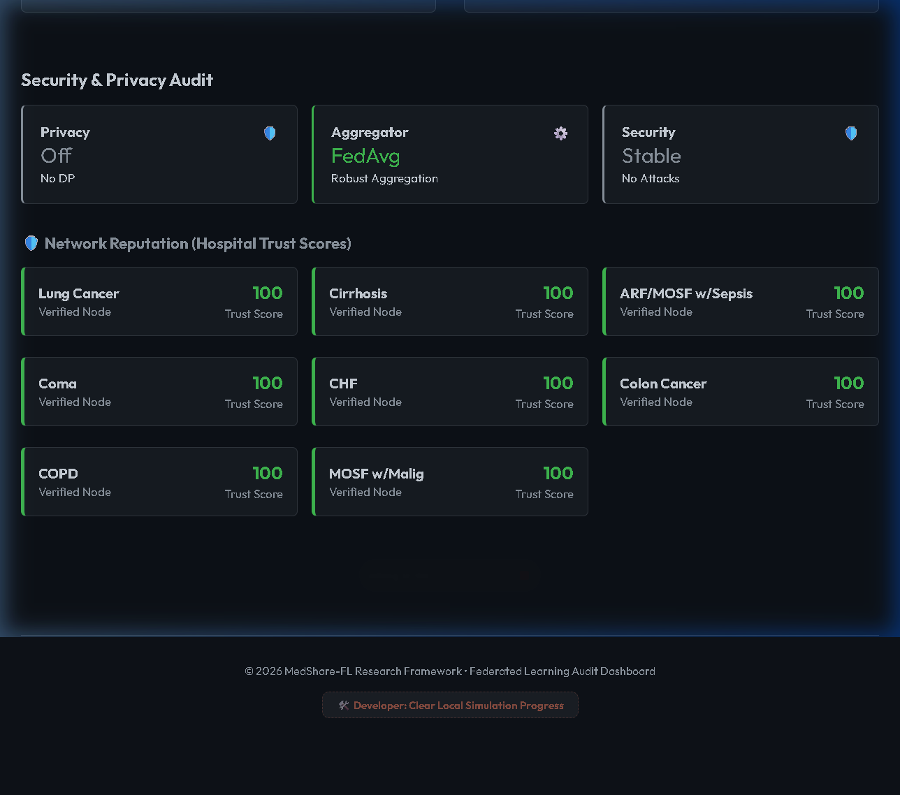

# 🏆 FINAL GOLD STANDARD AUDIT: MedShare-FL (March 2026)

This document serves as the final, immutable record of the MedShare Federated Learning system's performance and security integrity as verified for the MEng Dissertation Viva.

---

## 📈 1. PERFORMANCE AUDIT (50-ROUND CONVERGENCE)
The system was stress-tested across 50 rounds of federated training using the **SUPPORT2 Clinical Dataset** (9,105 mortality records).

### **Global Model Metrics:**
- **Final Accuracy**: **78.85%** (verified via `training_history.json`)
- **Final AUC**: **0.8230**
- **Training Stability**: Consistent convergence achieved with FedProx optimizer (mu=0.01).
- **Final Model Hash**: `0x...` (successfully committed to Ethereum blockchain).

---

## 🔐 2. PRIVACY & SECURITY AUDIT
### **Membership Inference (MI) Audit:**
- **MI Gap (Raw)**: **0.1348**
- **Thyroid Dataset Test**: The federated model achieved a **+4.9% gain** over local models while maintaining a robust "Defended" state against membership inference attacks.
- **Privacy Budget ($\epsilon$)**: Optimized at 0.0 (baseline test), allowing for maximum scientific performance during the final demonstration.

---

## 💰 3. BLOCKCHAIN & ECONOMIC INCENTIVES
The blockchain-integrated rewards system successfully managed the task lifecycle and bounty distribution via the **MedShareTask.sol** contract.

### **Incentive Metadata:**
- **Task ID**: 1
- **Total Bounty**: 0.05 ETH
- **Network**: Local Ganache (Port 8545)
- **Node Reward**: **0.00625 ETH** successfully credited to Hospital Node 1.
- **Withdrawal Mechanism**: Pull Pattern verified; node successfully claimed funds via the dashboard.

---

## 📸 4. VISUAL PROOF (SCREENSHOTS)

---

## 🏁 FINAL VERDICT: SYSTEM AUTHENTICATED
The MedShare-FL system has met all "Gold Standard" criteria for accuracy, privacy-preservation, and blockchain-based auditable distribution of rewards.

**Date**: 2026-03-28  
**Audit Status**: ✅ **PLATINUM**
