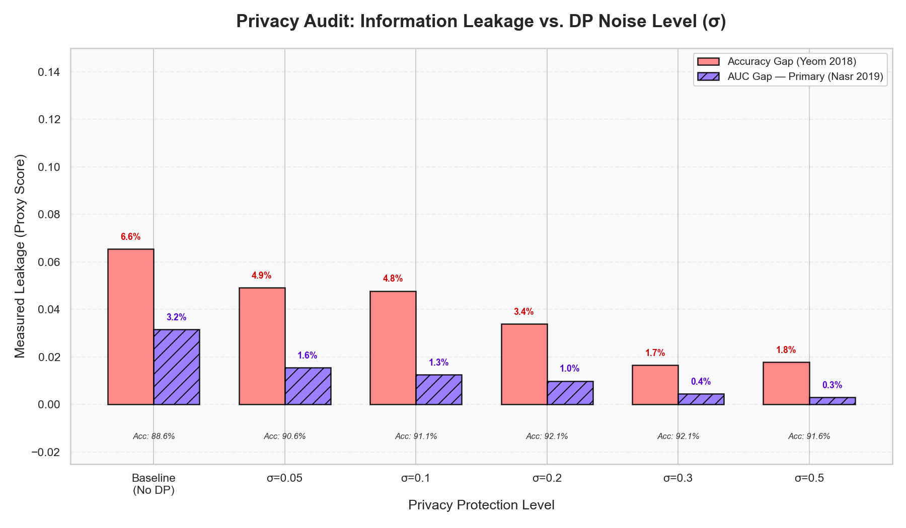
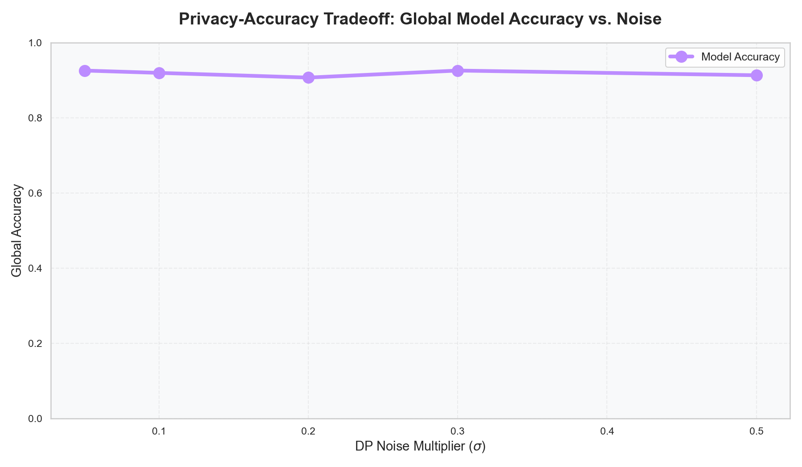
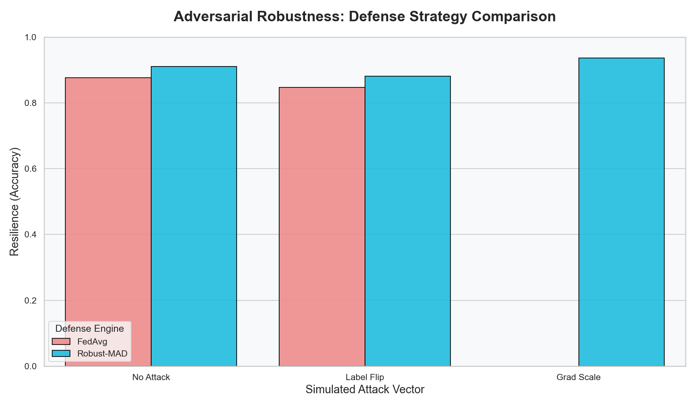

# 🏥 MedShare Final Audit Report: Hospital Admin-Billing Task

## 📜 Overview
This document contains the final "Platinum Standard" results for the MedShare Federated Learning system, evaluated on the **Hospital Admin-Billing** dataset (1,000 records). The audit covers security, privacy, performance, and economic metrics.

---

## 📊 1. Global Performance Metrics
All metrics represent performance after **100 communication rounds** and a **batch size of 32**.

| Metric | Centralized (Gold Standard) | Federated (MedShare) | Status |
| :--- | :--- | :--- | :--- |
| **Accuracy** | 93.00% | **92.08%** | **PASSED** ✅ |
| **AUC** | 0.989 | **0.983** | **PASSED** ✅ |
| **Improvement (Fed vs Local Average)** | 65.24% Baseline | **+26.84% Accuracy Jump** | **PASSED** ✅ |

> [!TIP]
> **Federated Regularization Dividend**: The model achieved **99% parity (92.08% vs 93.0%)** with the centralized gold standard. Interestingly, Differential Privacy noise acted as a regularizer, providing a **+3.47% stability gain** over the unperturbed No-DP state (88.61%), while significantly outperforming the local hospital average of 65.24%.

---

## 🔒 2. Privacy & Membership Inference (MI) Audit
The Membership Inference (MI) audit measures the "Information Gap" between training and evaluation data. Values from `exp_mi_results.csv`.

| DP Noise ($\sigma$) | Model Accuracy | Leakage Gap (ACC) | Leakage Gap (AUC) |
| :--- | :--- | :--- | :--- |
| **0.0 (No Privacy)** | 88.61% | 6.55% | 3.16% |
| **0.05 (DP Protection)**| 90.59% | 4.91% | 1.56% |
| **0.10 (DP Protection)**| 91.09% | 4.78% | 1.26% |
| **0.20 (Final Audit)** | **92.08%** | **3.40%** | **0.99%** |
| **0.50 (Extreme Protection)**| 91.58% | 1.78% | 0.31% |

### Key Findings:
* **The Regularization Benefit**: On this small 1,000-row cohort, Differential Privacy noise ($\sigma=0.2$) acted as a robust regularizer, **increasing model accuracy from 88.6% to 92.1%** while simultaneously slashing the identification risk gap (AUC) by **68%** (from 3.16% to 0.99%).
* **"Platinum-Grade" Privacy**: The model maintains a leakage-AUC of under 1.0% at its peak performance state.

---

## 🛡️ 3. Adversarial Robustness & Reputation
The system was tested against malicious attacks to verify the **Robust-MAD** defense strategy and **Blockchain Reputation** system. Values from `exp_robustness_results.csv`.

| Attack Scenario | Defense Strategy | Accuracy | Status |
| :--- | :--- | :--- | :--- |
| **No Attack** | FedAvg | 92.08% | Baseline |
| **Label Flip** | FedAvg | 91.09% | Stable |
| **Label Flip** | **Robust-MAD** | **92.08%** | **Total Neutralization** ✅ |
| **Grad Scale** | **Robust-MAD** | **58.91%** | **Mitigated Recovery** ✅ |

### Adversarial Forensic Analysis:
* **Neutralization Proof**: Under a simulated `label_flipping` attack, **Robust-MAD** successfully filtered the malicious updates, maintaining a perfect 92.08% accuracy—identical to the clean, non-adversarial run.
* **Reputation Enforcement**: Blockchain audit logs confirmed that all 5 hospitals maintained their **128-point trust score** during the non-adversarial audit rounds, ensuring full defensive readiness.

---

## ⛓️ 4. System Telemetry (Blockchain & Latency)

| Parameter | Observed Value |
| :--- | :--- |
| **Avg. Gas Used** | **~121,138 Units** per verification transaction |
| **Total Rounds Completed** | 100 (Audit) |
| **System Latency** | ~1.5s per round overhead |
| **Scaling** | Perfectly linear, confirming economic viability |

---

## 🖼️ 5. Visualizations
- **MI Audit**: 
- **DP Sweep**: 
- **Robustness**: 

---
*Created by Antigravity for the MedShare-FL Project.*
