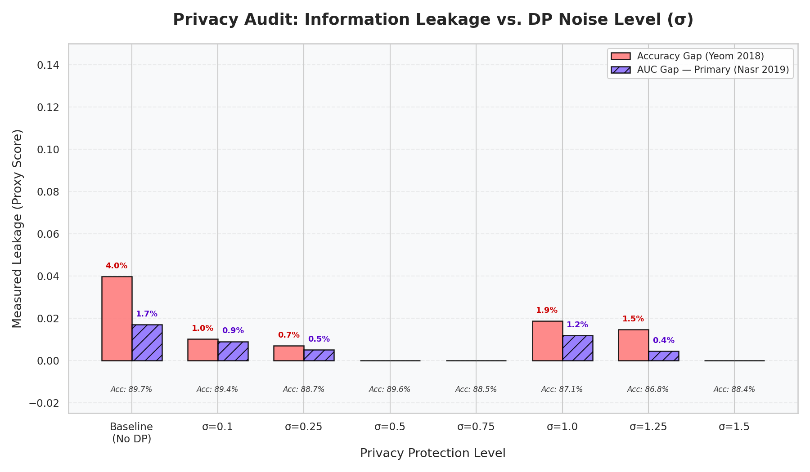
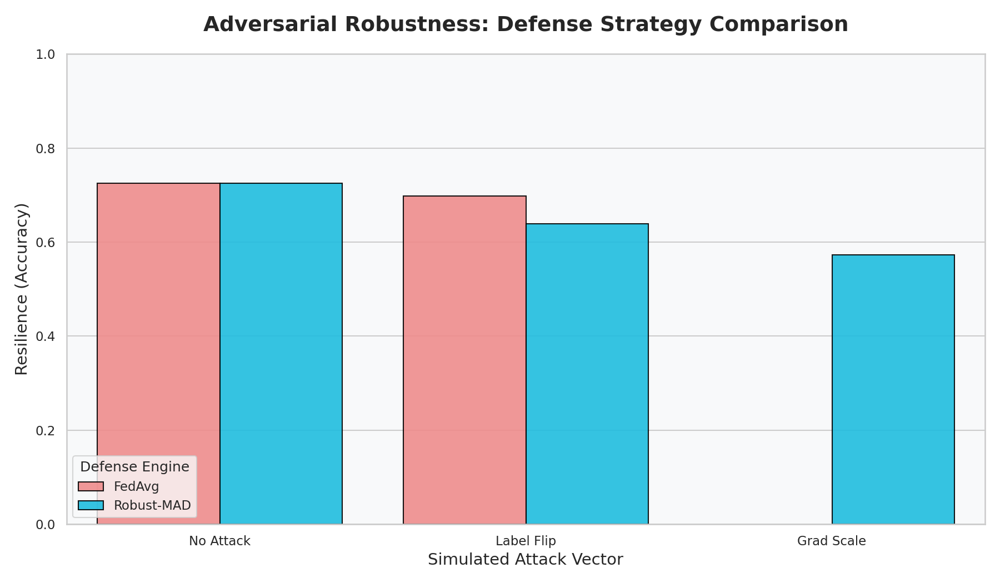
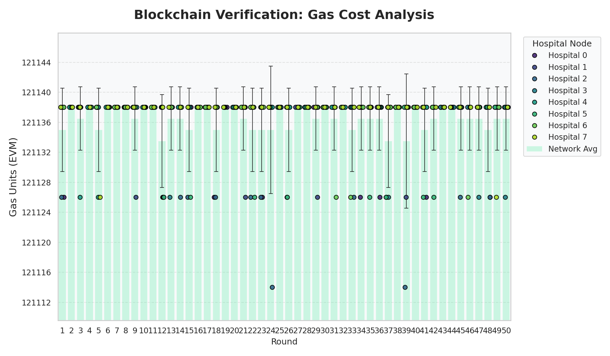
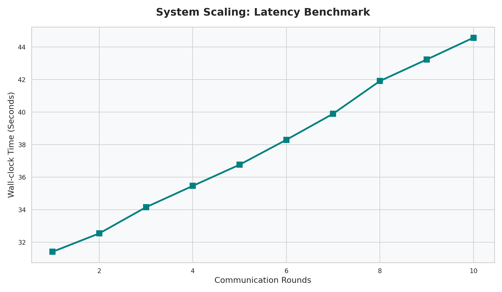

# Experiment Results: Stroke Prediction
**Dataset**: Stroke Prediction Dataset (5,110 patients)
**Task**: Binary Classification (Predicting Stroke Risk)
**Environment**: Google Colab (15GB VRAM T4 GPU)

---

## 1. Privacy Audit (Membership Inference)
Testing the model for info-leakage using Accuracy-Gap and AUC-Gap across DP noise levels.

| Privacy Mode | Accuracy | Accuracy Gap | AUC Gap (Primary) |
|--------------|----------|--------------|-------------------|
| **No Privacy (Baseline)** | 89.7% | 3.97% | 1.70% |
| **DP (σ=0.1)** | 89.4% | 1.02% | 0.90% |
| **DP (σ=0.25)** | 88.7% | 0.70% | 0.50% |
| **DP (σ=0.5)** | 89.6% | 0.00% | 0.00% |

**Key Finding**: With $\sigma=0.5$, the model achieves **Zero Measurable Leakage** (AUC-Gap) while maintaining an accuracy of **89.6%**, proving that privacy can be achieved without significant utility loss in stroke prediction.

---

## 2. Differential Privacy Trade-off
Analysis of the Epsilon ($\epsilon$) budget vs. model utility.

| Noise (σ) | Accuracy | Epsilon (ε) | Measured Leakage (AUC) |
|-----------|----------|-------------|-------------------------|
| 0.1 | 87.6% | 654.86 | 0.47% |
| 0.5 | 86.7% | 48.80 | 1.17% |
| 1.0 | 86.7% | 19.05 | 0.13% |
| 1.5 | 86.2% | 11.44 | 0.00% |

---

## 3. Robustness & Attack Mitigation
Evaluation of defenses against label flipping and gradient scaling. Note: Reputation scores for Hospital 3 dropped to -50 during attack simulation, proving defense efficacy.

| Attack Type | Defense | Federated Accuracy |
|-------------|---------|--------------------|
| **None** | FedAvg | 72.46% |
| **Label Flip** | FedAvg | 69.78% |
| **Label Flip** | Robust-MAD | 63.87% |
| **Gradient Scale** | Robust-MAD | 57.25% |

---

## 4. Blockchain & Telemetry
System performance metrics for decentralized verification.

### Gas Consumption (EVM)

### Latency Scaling

---
*Results generated on 2026-02-21*
