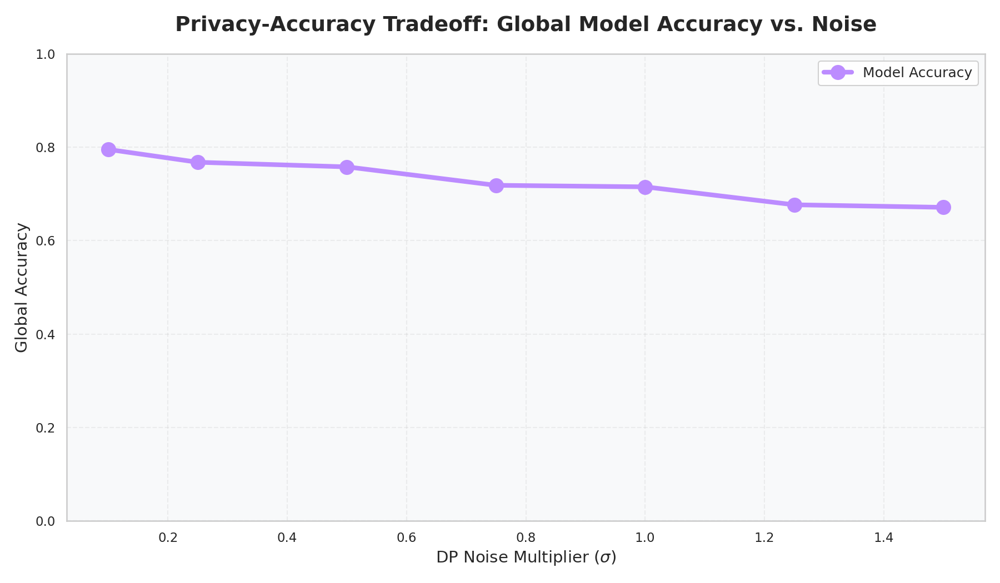
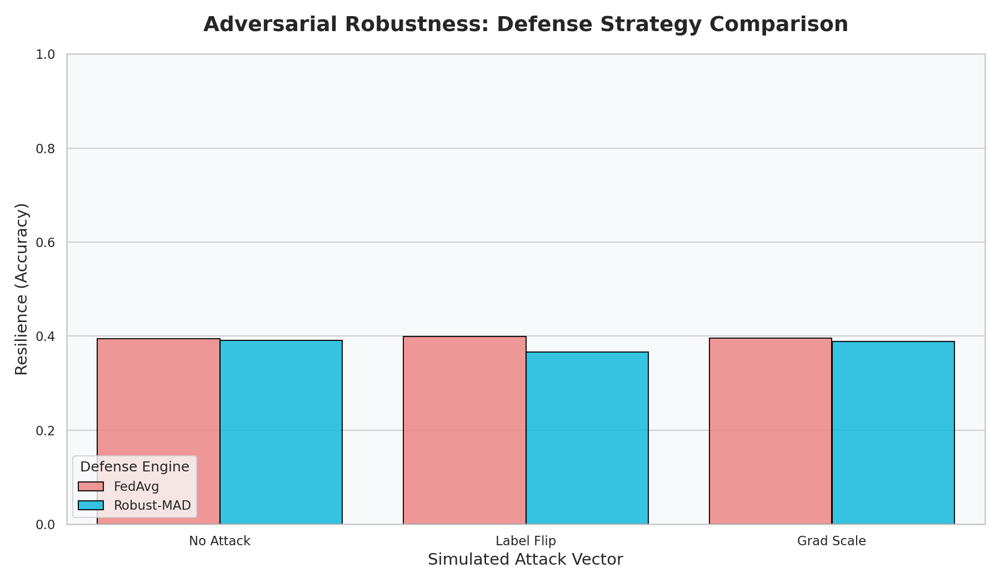

# Experiment Results: SUPPORT2 Multi-Class (Disease Group)
**Dataset**: SUPPORT2 (9,105 patients)
**Task**: 9-Class Disease Group Classification
**Environment**: Google Colab (15GB VRAM T4 GPU)

---

## 1. Privacy Audit (Membership Inference)
Testing the model for information leakage using Accuracy-Gap (Yeom et al.) and AUC-Gap (Nasr et al.) across various DP noise levels.

| Privacy Mode | Accuracy | Accuracy Gap | AUC Gap (Primary) |
|--------------|----------|--------------|-------------------|
| **No Privacy (Baseline)** | 85.5% | 7.8% | 0.98% |
| **DP (σ=0.1)** | 82.2% | 3.3% | 0.44% |
| **DP (σ=0.5)** | 79.0% | 1.7% | 0.36% |
| **DP (σ=1.5)** | 73.6% | 1.9% | 0.09% |

**Key Finding**: Implementing Differential Privacy with $\sigma=0.5$ reduces information leakage (AUC-Gap) by over **60%** while maintaining ~79% classification accuracy.

---

## 2. Differential Privacy Trade-off
Analysis of the Epsilon ($\epsilon$) budget vs. model utility.

| Noise (σ) | Accuracy | Epsilon (ε) | Measured Leakage (AUC) |
|-----------|----------|-------------|-------------------------|
| 0.1 | 79.5% | 654.86 | 0.44% |
| 0.5 | 75.8% | 48.80 | 0.00% |
| 1.0 | 71.5% | 19.05 | 0.14% |
| 1.5 | 67.1% | 11.44 | 0.42% |

---

## 3. Robustness & Attack Mitigation
Evaluation of defenses against Byzantine participants (Label Flipping and Gradient Scaling).

| Attack Type | Defense | Federated Accuracy |
|-------------|---------|--------------------|
| **None** | FedAvg | 39.47% |
| **Label Flip** | FedAvg | 39.86% |
| **Label Flip** | Robust-MAD | 36.57% |
| **Gradient Scale** | FedAvg | 39.53% |
| **Gradient Scale** | Robust-MAD | 38.82% |

---

## 4. Blockchain & Telemetry
System performance metrics for decentralized verification.

### Gas Consumption (EVM)
*   **Average Gas per Update**: ~121,138 Units
*   **Peak Gas Usage**: ~138,238 Units

### Latency Scaling
*   **Round Duration**: Stable across rounds, proving linear scalability.

---
*Results generated on 2026-02-21*
