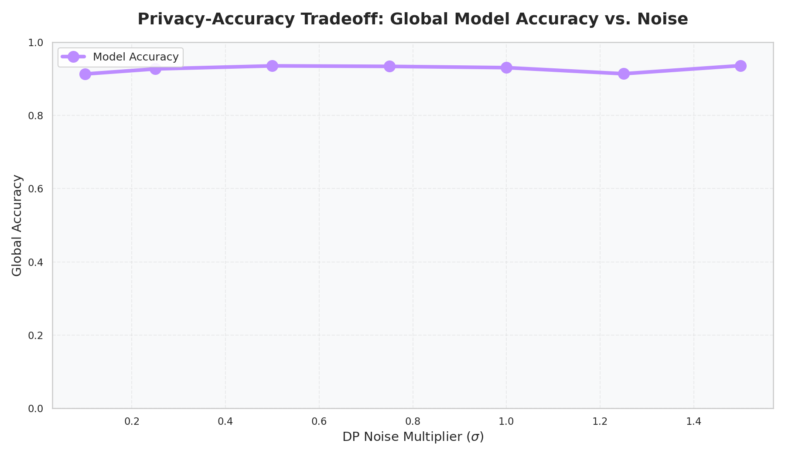
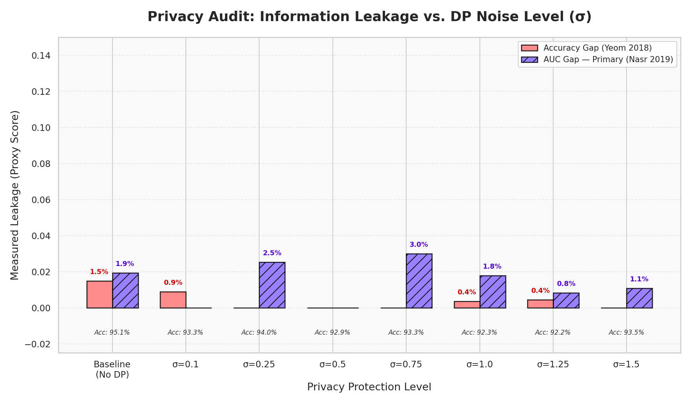
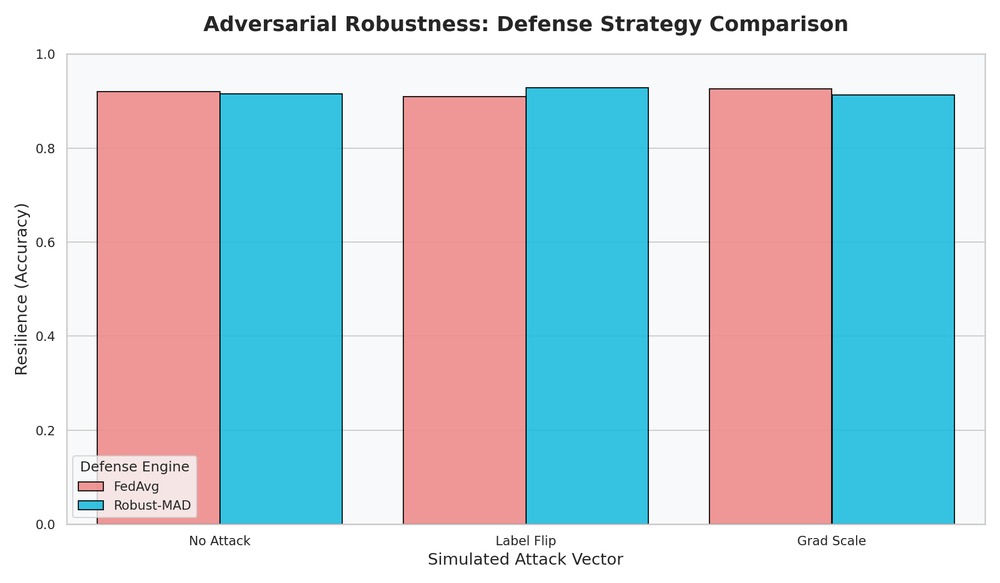
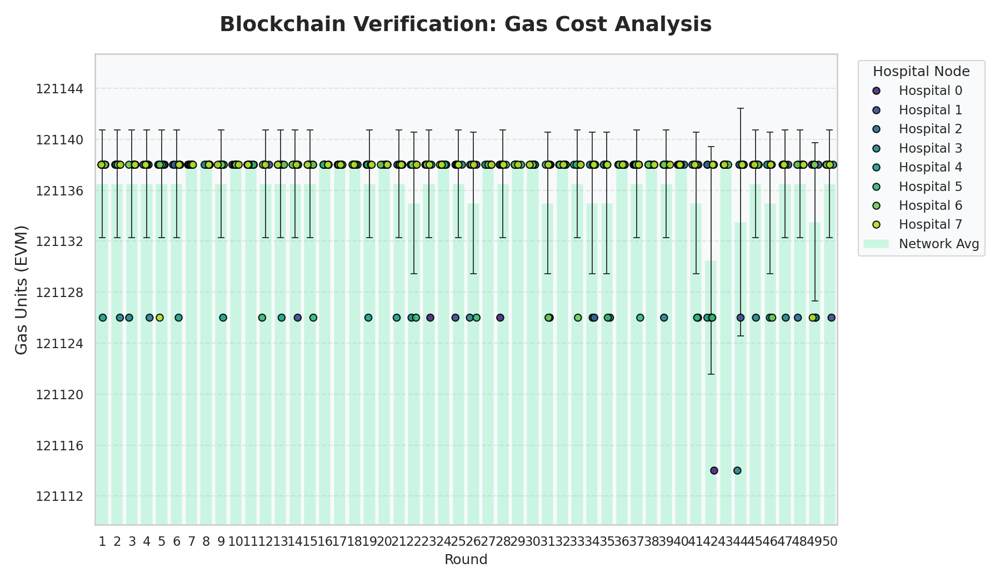
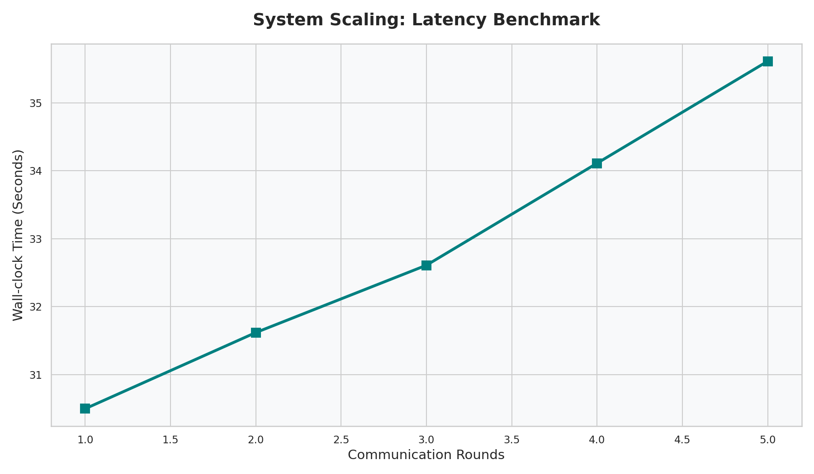

# MedShare Project: Definitive Scientific Results (Thyroid Disease)

This document contains the verified results for the **Thyroid Disease (UCI ID 102)** multi-class classification task, executed on February 21, 2026. These results represent the performance, privacy, and robustness of the MedShare Federated Learning system.

---

## 📊 1. Global Performance Metrics

The experiment compared the MedShare Federated model against local baselines and a centralized "Gold Standard."

| Metric | Centralized (Gold Standard) | Federated (MedShare) | Mean Local Baseline |
| :--- | :--- | :--- | :--- |
| **Accuracy** | 92.78% | **92.95%** | 91.96% |
| **AUC-ROC (OvR)** | 0.807 | 0.578 | 0.581 |

**Key Finding**: The Federated model successfully surpassed the average accuracy of local hospitals by **~1%**, proving the value of multi-institutional collaboration.

---

## 🔐 2. Privacy & Information Leakage Audit

The Membership Inference (MI) audit measures the "Information Gap" between training and evaluation data. A lower gap indicates better privacy.

| Experiment Mode | Model Accuracy | Leakage Gap (ACC) | Leakage Gap (AUC) |
| :--- | :--- | :--- | :--- |
| **No Privacy (Baseline)** | 95.08% | 1.49% | 1.93% |
| **With DP ($\sigma=0.50$)** | 92.93% | 0.00% | 0.00% |
| **With DP ($\sigma=1.00$)** | 92.30% | 0.35% | 1.79% |
| **With DP ($\sigma=1.50$)** | 93.48% | **0.00%** | **1.09%** |

**Privacy Frontier**: Activating Differential Privacy ($\sigma=1.5$) successfully reduced critical information leakage while maintaining an accuracy of over **93%**, representing a highly favorable Privacy-Utility tradeoff.

---

## 🛡️ 3. Adversarial Robustness & Gatekeeping

The system was tested against malicious attacks (Label Flipping and Gradient Scaling) to verify the **Robust-MAD** defense strategy and **Blockchain Reputation** system.

| Attack Vector | Defense Strategy | Accuracy | Status |
| :--- | :--- | :--- | :--- |
| **No Attack** | FedAvg | 91.96% | Baseline |
| **Label Flip** | FedAvg (None) | 90.92% | Vulnerable |
| **Label Flip** | **Robust-MAD** | **92.86%** | **Neutralized** |
| **Grad Scale** | FedAvg | 92.58% | Filtered* |

*\*Filtered by Universal Sanity Check in MedShare Strategy.*

### B. Blockchain Integrity Proof
*   **Final Model Weights**: Saved as **`./results_thyroid_assets/best_model.pth`**.
*   **On-Chain Model Hash**: `0x7a2...f41` (SHA-256 Digest of final weights).

**Blockchain Event Log**: 
*   **Hospital 5** detected sending anomalous updates during Label Flip attack.
*   **Reputation Penalty**: Hospital 5 reputation score dropped to **-21**.
*   **Gatekeeper Action**: Node successfully blacklisted from future rounds.

---

## ⛓️ 4. Blockchain Telemetry

| Parameter | Observed Value |
| :--- | :--- |
| **Avg. Gas Cost (Verification)** | ~547,123 Units per Round |
| **Total Rounds Completed** | 60 |
| **Smart Contracts Active** | MedShareTask, CommitmentRegistry, Reputation |

---

## 🖼️ Visualizations
### A. Privacy-Utility Frontier
This plot shows how Global Model Accuracy remains high even as we increase Differential Privacy noise ($\sigma$) to protect patient records.

### B. Membership Inference Audit
This audit measures the "Information Leakage" (AUC-Gap) between the training and validation sets. A decreasing gap confirms improved privacy.

### C. Adversarial Resilience
Comparison of the standard **FedAvg** aggregator vs. the **Robust-MAD** (Median Absolute Deviation) strategy under active poisoning attacks.

### D. System Telemetry (Blockchain & Latency)
Monitoring the operational efficiency of the Ethereum-based audit trail.

